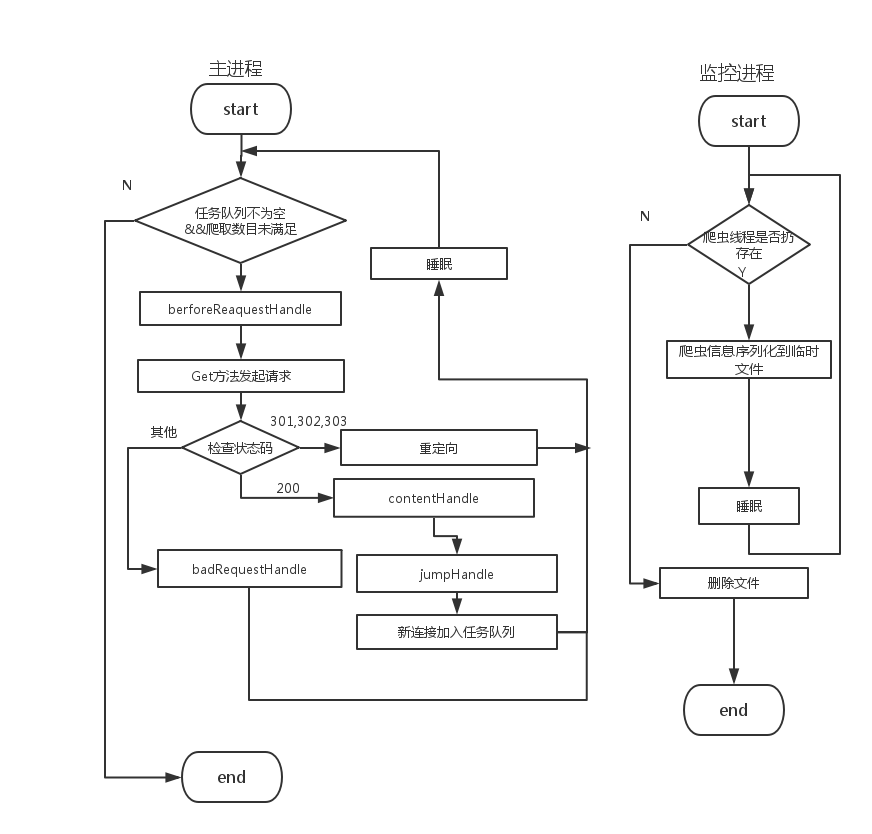

**Temporarily does not provide an English version, please wait……**

---

##简介
FunnySpider是支持以下功能爬虫框架

- [x]可自定义行为
- [x]周期记录爬虫信息
- [ ]简单的HTML的提取器
- [ ]将目前多线程的方式改成线程池实现
- [ ]支持数据库
- [ ]支持解释js
- [ ]支持分布式
- [ ]支持日志管理
- [ ]断点恢复爬取
- [ ]根据配置文件来配置爬虫

该框架目前主要是为了方便自己平常爬取数据使用

VERSION:0.1
date:2016.8.4

###流程图




接口简介

- BadRequestHandle 
  处理非200，和非重定向的响应，默认往标准错误流输出错误码和原因

- BeforeRequestHandle 
  进行爬取的预处理，可以通过```setFalg```来设置是每次访问都进行预处理，还是仅在第一次访问才进行预处理。
  默认是不做处理，但FunnySpider提供了```Login```类，来处理一些需要登陆获取```cookie```才能爬取的网页

- ContentHandle
  对爬取回来的正文进行处理，默认在控制台上输出基本信息。可用```setCharset```设定正文的编码，默认utf-8

- ExceptionHandle
  在爬取过程中触发异常的处理，默认为向标准错误流中输出信息

- JumpHandle
  在多页面爬取中，对页面链接的挑选规则。默认是全部```a```标签内的连接都会加入任务队
  列。


可通过实现上述接口来自定义爬虫不同时期的行为。更多的API使用请查看文档

**注意，目前爬虫只会周期在名为temp的目录下生成```.temp```文件，记录爬虫的信息，并没有机制让用户主动查询爬取状态。
用户需自行打开temp文件来获取爬虫的状态。**


###代码示例

比如说，我当前需要以```http://www.meizitu.com```为起点来启动3条线程来爬取并保存5张网页，
每个url访问的超时限制为2秒，利用FunnySpider你可以写下如下代码
```
import FunnySpider.*;
import FunnySpider.util.*;
import FunnySpider.util.net.*;
import java.io.*;

public class abc implements ContentHandle {
	private int nameNum = 1;	
	@Override
	public void cHandle(SpiderInfo sinfp,String html) {
		String filename = nameNum + ".html";
		try {
			OutputStreamWriter fw = new OutputStreamWriter(new FileOutputStream(filename),"gbk");
			fw.write(str);
			fw.flush();
			fw.close();
			nameNum += 1;
			System.out.println(filename +" --------------> 下载成功");
		} catch (Exception e) {
			e.printStackTrace(System.err);
		}
	}

}

public class Test{

	public static void main(String[] args) {
		String url = "http://www.meizitu.com";
		new SpiderApp(url).setPageNum(5).setThreadNum(3).
			setContentHandle(new abc())
			.run(2);
	}

}
```

保存文本文件的操作太常见，在FunnySpider内提供了DownLoad类来下载文本文件和二进制文件，
因此，上面abc类的代码可以改写为

```
public class abc implements ContentHandle {
	private int nameNum = 1;	
	@Override
	public void cHandle(SpiderInfo sinfo,String html) {
		String filename = nameNum + ".html";
		try {
			Download.saveString(html, filename,"gbk");
			nameNum += 1;
			System.out.println(filename +" --------------> 下载成功");
		} catch (Exception e) {
			e.printStackTrace(System.err);
		}
	}

}
```

abc类除了下载文本外还能显示一些基本信息，而为了方便使用，
FunnySpider提供了SaveFile()类封装了下载操作和信息提示以及提供接口控制需写入文件的编码，
因此上述全部代码可简化成如下样子：

```
import FunnySpider.*;
import FunnySpider.util.*;
import FunnySpider.util.net.*;
public class Test{
	public static void main(String[] args) {
		String url = "http://www.meizitu.com";
		new SpiderApp(url).setPageNum(5).setThreadNum(3).
			setContentHandle(new SavaFile("gbk")).setCharset("gbk")
			.run(2);
	}
}
```


##联系方式

 + QQ邮箱：ljc456@qq.com
 + Twitter [@fatfatrabbit](https://twitter.com/fat_fat_Rabbit)